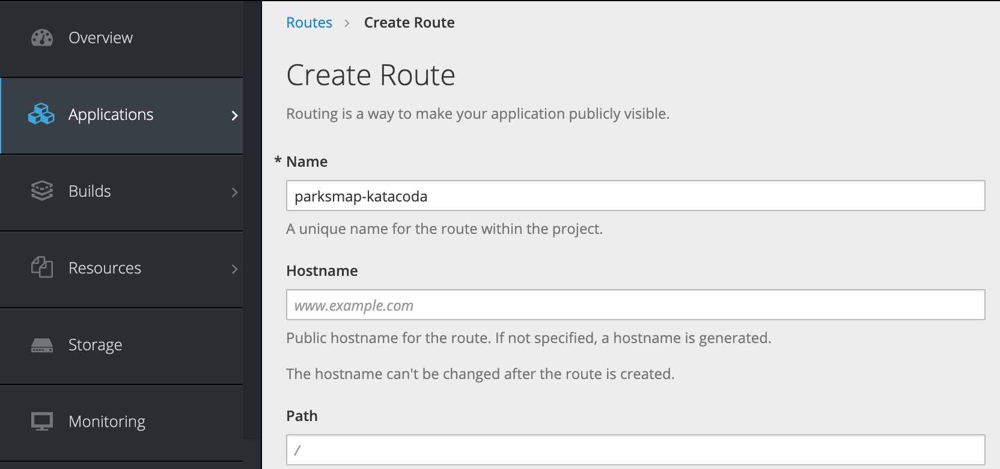

# OpenShift Studies

OpenShift Container Platform is to develop, deploy, and run containerized applications, it is based on docker and kubernetes with added features like:

* routes: represents the way external clients are able to access applications running in OpenShift
* deployment configs 
* CLI, [REST API](https://docs.openshift.org/latest/rest_api/index.html) for administration or Web Console, and [Eclipse plugin](https://tools.jboss.org/features/openshift.html).
* built to be multi tenants. You can also grant other users access to any of your projects. 
* Use the concept of project to allow for controlled accesses and quotas for developers. Projets are mapped to k8s namespaces.
* [Source-to-image (S2I)](https://docs.openshift.org/latest/creating_images/s2i.html) is a tool for building reproductible Docker images. S2I supports incremental builds which re-use previously downloaded dependencies, and previously built artifacts. OpenShift is S2I-enabled and can use S2I as one of its build mechanisms.
* OpenShift for production comes in several variants:
    * OpenShift Origin: from [http://openshift.org](http://openshift.org)
    * OpenShift Container Platform: integrated with RHEL and supported by RedHat. It allows for building a private or public PaaS cloud 
    * OpenShift Online: multi-tenant public cloud managed by Red Hat
    * OpenShift Dedicated: single-tenant container application platform hosted on Amazon Web Services (AWS) or Google Cloud Platform and managed by Red Hat.

The way that external clients are able to access applications running in OpenShift is through the OpenShift routing layer. The default OpenShift router (HAProxy) uses the HTTP header of the incoming request to determine where to proxy the connection. 

## Concepts

Openshift is based on kubernetes. It adds the concept of project, mapped to a k8s namespace, to govern the application access control, resource quota and life cycle. It is the top-level element for an application.

We can deploy any docker image  as soon as they are well built: such as defining the port any service is exposed on, not needing to run specifically as the root user or other dedicated user, and which embeds a default command for running the application.

The default OpenShift router (HAProxy) uses the HTTP header of the incoming request to determine where to proxy the connection. 

Routes defines hostname, service name, port number and TLS settings:

Routes are used to expose app over HTTP. OpenShift can handle termination for secure HTTP connections, or a secure connection can be tunnelled through direct to the application, with the application handling termination of the secure connection. Non HTTP applications can be exposed via a tunnelled secure connection if the client supports the SNI extension for a secure connection using TLS.

## Getting started

We can use minishift on laptop to play with openshift one node.

We can also use [openshift online](https://docs.openshift.com/online/getting_started/basic_walkthrough.html) 

## Deploying App

Three main methods to add an app to openshift:

* Deploy an application from an existing Docker-formatted image. (Using `Deploy Image` in the project view.)

!!! note
        There are two options: from an image imported in the openshift cluster, or built from a dockerfile inside the cluster. Or by accessing a remote image repository like `Dockerhub`. The image will be pulled down and stored within the internal OpenShift image registry. The image will then be copied to any node in the OpenShift cluster where an instance of the application is run.
        Application will, by default, only be visible internally to the OpenShift cluster, and usually only to other applications within the same project. Use `Create route` to make it public. 

* Build and deploy from source code contained in a Git repository using a Source-to-Image builder.
* Build and deploy from source code contained in a Git repository from a Dockerfile.
