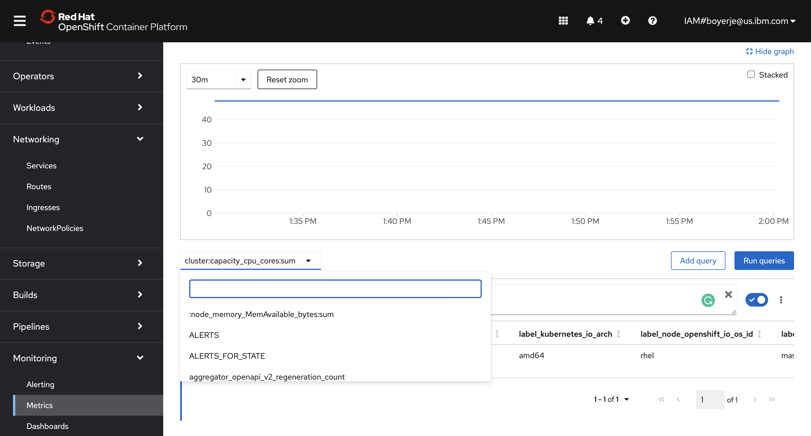
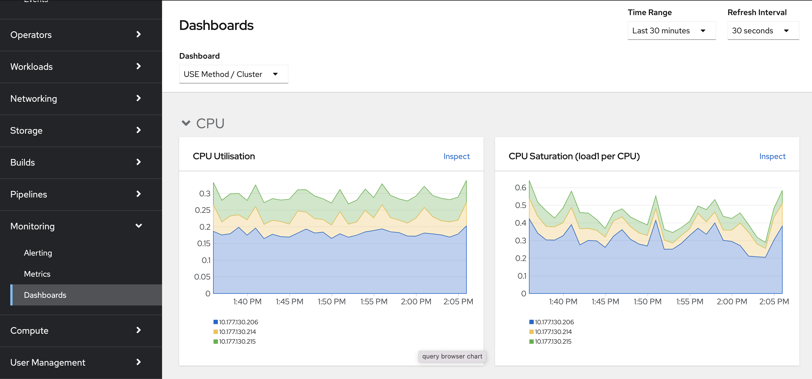

# OpenShift Studies

OpenShift Container Platform is about developing, deploying, and running [containerized](/docker) applications. It is based on docker and Kubernetes and add the following features:

* **Routes**: represents the way external clients are able to access applications running on OpenShift. 
The default OpenShift router (HAProxy) uses the HTTP header of the incoming request to determine where to proxy the connection.
* **[Deployment config](https://docs.openshift.com/container-platform/4.1/applications/deployments/what-deployments-are.html)**: Represents the set of containers included in a pod, and the deployment strategies to be used. 
DeploymentConfigs involve one or more ReplicationControllers, which contain a point-in-time record of the state of a DeploymentConfig as a Pod template
* CLI, [REST API](https://docs.OpenShift.org/latest/rest_api/index.html) for administration or Web Console
* Multi tenants. You can also grant other users access to any of your projects. 
* [Source-to-image (S2I)](https://docs.OpenShift.org/latest/creating_images/s2i.html) is a tool for building reproducible Docker images. S2I supports incremental builds which re-use previously downloaded dependencies, and previously built artifacts. OpenShift is S2I-enabled and can use S2I as one of its build mechanisms.
* **Build config**: Used by the OpenShift Source-to-Image (S2I) feature to build a container image from application source code stored in a Git repository

* OpenShift for production comes in several variants:

    * OpenShift Origin: from [http://OpenShift.org](http://OpenShift.org)
    * OpenShift Container Platform: integrated with RHEL and supported by RedHat. It allows for building a private or public PaaS cloud.
    * OpenShift Online: multi-tenant public cloud managed by Red Hat
    * OpenShift Dedicated: single-tenant container application platform hosted on Amazon Web Services (AWS) or Google Cloud Platform and managed by Red Hat.

See also [my summary on k8s](k8s/k8s-0.md).

## Concepts

OpenShift is based on Kubernetes. It adds the concept of **project**, mapped to a k8s namespace, to govern the application access
 control, resource quota and application's life cycle. Project is the top-level element for one to many applications.

We can deploy any docker image, as soon as they are well built: such as defining the port any service is exposed on, 
not needing to run specifically as the root user or other dedicated user, and which embeds a default command for running the application.

Routes are used to expose app over HTTP. OpenShift can handle termination for secure HTTP connections, or a secure connection can be tunneled through the application, 
with the application handling termination of the secure connection. Non HTTP applications can be exposed via a tunneled secure connection if the client supports
 the SNI extension for a secure connection using TLS.
A router (ingress controller) forwards HTTP and TLS requests to the service addresses inside the Kubernetes SDN.

OpenShift routes are implemented by a cluster-wide router service, which runs as a containerized application in the OpenShift cluster. 
The router service uses HAProxy as the default implementation.

[Red Hat OpenShift on IBM Cloud](https://developer.ibm.com/openlabs/OpenShift) is a preconfigured OpenShift environment available
 for four hours at no charge. 

[Note from the Red Hat OpenShift training](/notes-ocp-training)

## Getting started

Use IBM Cloud cluster feature to get an OpenShift cluster.

Be familiar with [OC cli commands](oc-cli.md).

## Collaborate

User can be added to an existing project, via the View membership menu on a project. Each user can have different roles. 
`Edit Role` can perform most tasks within the project, except tasks related to administration of the project.

!!! Remark
    State about the current login session is stored in the home directory of the local user running the `oc` command, 
    so user needs to logout and login to access a second cluster. 

## Monitoring

The approach an organization takes to Monitoring and Alerting on events of importance is one of the most important considerations for an enterprise.
The **goal** of any monitoring endeavor is to provide observability of the platform and applications so that one can "ask" questions to spot anomalies and un-cover the cause of an unplanned issue as quickly as possible.

### [Monitoring Overview - OCP4.8](https://docs.openshift.com/container-platform/4.8/monitoring/monitoring-overview.html)

    * OpenShift Container Platform includes a preconfigured, preinstalled, and self-updating monitoring stack that provides monitoring for core platform components.
    * A set of alerts are included by default that immediately notify cluster administrators about issues with a cluster. 
    * Default dashboards in the OpenShift Container Platform web console include visual representations of cluster metrics to help you to quickly understand the state of your cluster.
    *  access to third-party interfaces, such as Prometheus, Alertmanager, and Grafana.
    * The OpenShift Container Platform monitoring stack is based on the [Prometheus](https://prometheus.io/) open source project and its wider ecosystem. The namespace is `openshift-monitoring`

### [Configuration](https://docs.openshift.com/container-platform/4.8/monitoring/configuring-the-monitoring-stack.html):

    * To configure core OpenShift Container Platform monitoring components, you must create the cluster-monitoring-config ConfigMap object in the openshift-monitoring project.

    ```sh
    oc -n openshift-monitoring get configmap cluster-monitoring-config
    # if not present
    oc apply -f - <<EOF
    apiVersion: v1
    kind: ConfigMap
    metadata:
        name: cluster-monitoring-config
        namespace: openshift-monitoring
    data:
        config.yaml: |
    EOF
    ```
    * To configure the components that monitor user-defined projects, you must create the user-workload-monitoring-config ConfigMap object in the openshift-user-workload-monitoring project.
    ```sh
    oc -n openshift-user-workload-monitoring get configmap user-workload-monitoring-config
    # if not present
    oc apply -f - <<EOF
    apiVersion: v1
    kind: ConfigMap
    metadata:
        name: user-workload-monitoring-config
        namespace: openshift-user-workload-monitoring
    data:
        config.yaml: |
    EOF
    ```
    Add any key-value under this configuration for each component to configure
    * See the [Configurable monitoring components](https://docs.openshift.com/container-platform/4.8/monitoring/configuring-the-monitoring-stack.html#configurable-monitoring-components_configuring-the-monitoring-stack)

* Many of the monitoring components are deployed by using multiple pods across different nodes in the cluster to maintain high availability.
* Running cluster monitoring with persistent storage means that your metrics are stored to a persistent volume (PV) and can survive a pod being restarted or recreated. See [Prometheus database storage requirements](https://docs.openshift.com/container-platform/4.8/scalability_and_performance/scaling-cluster-monitoring-operator.html#prometheus-database-storage-requirements_cluster-monitoring-operator)

### Day 2 for monitoring: 

    * Viewing performance data in the login dashboard
    * Viewing Prometheus metrics
    * Confirm the default Grafana dashboards are available
    * Verify actionable alerts are flowing to the correct destination

    Access Prometheus using ` Monitoring > Metrics >` In the query field, enter your PromQL query.

    

    Access Grafana with ` Monitoring > Dashboard >`

     

    Included with the Monitoring Stack are ~120 predefined alerts. The Alert Manager is available by selecting Alerts under the monitoring tab in the web console. Here are some [Grafana OpenShift dashboards](https://grafana.com/grafana/dashboards/?search=OpenShift) that could
    be deployed in your own namespace.

    We recommend integrating the Alert Manager and any other Monitoring tools you use with your organizations event management solution.

    OCP provides Operators for integration with third party products such as New Relic, Sysdig, and Prometheus.

### Custom dashboard

    * Create a namespace
    * Install community-powered Grafana Operator
    * Create a new Grafana instance.
    * Connect the community supported Grafana in the my-grafana namespace to OpenShift monitoring in the openshift-monitoring namespace
    * Grant grafana-serviceaccount service account the cluster-monitoring-view cluster role.

    ```sh
    oc adm policy add-cluster-role-to-user cluster-monitoring-view -z grafana-serviceaccount
    ```
    * The bearer token for this service account is used to authenticate access to Prometheus in the openshift-monitoring namespace.  The following command will display this token.

    ```sh
    oc serviceaccounts get-token grafana-serviceaccount -n my-grafana
    ```
    * From the Grafana Data Source resource, press Create Instance, and navigate to the YAML view.  In the below YAML, substitute ${BEARER_TOKEN} with the output of the command above.
    * Use custom Grafana dashboards or create your own.

???- "Read more"
    * [Product documentation - Enabling monitoring for user-defined projects](https://docs.openshift.com/container-platform/4.8/monitoring/enabling-monitoring-for-user-defined-projects.html)
    * [Product documentation - configuring monitoring stack](https://docs.openshift.com/container-platform/4.8/monitoring/configuring-the-monitoring-stack.html)
    * [OCP Day 2 Operations](https://github.ibm.com/CASE/OCP-Day2-operations/tree/master/Monitoring)
    * [2020 - Custom Grafana dashboards for Red Hat OpenShift Container Platform 4](https://www.redhat.com/en/blog/custom-grafana-dashboards-red-hat-openshift-container-platform-4)