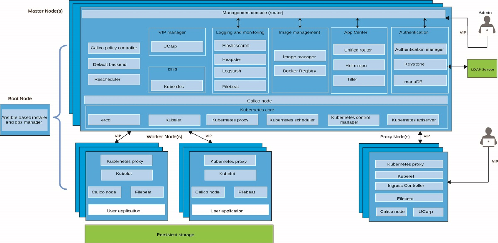

# Kubernetes Introduction

Kubernetes is an open-source system for automating deployment, scaling, and management of containerized applications. 
It groups containers that make up an application into logical units for easy management and discovery.


## Key features

A Kubernetes cluster consists of one or more physical or virtual machines, also known as worker nodes, that are loosely coupled, extensible, and centrally monitored and managed by the Kubernetes master nodes.

A cluster defines a set of resources, nodes, networks, and storage devices that keep applications highly available.

* **Service discovery** by assigning a single DNS entry to each set of containers, service discovery permits **load-balancing** the request across the pool of containers providing the service, and supports automatic load balancing around failure.
* **Horizontal scaling** is supported by adding new worker nodes to the cluster, or by adding more service instances
* **Self-healing** uses user-defined health checks to monitor containers liveness and restart and reschedule them in case of failure.
* **Automated rollout** gradually roll updates out to your application's containers while checking their status. If something goes wrong during the rollout, Kubernetes can roll back to the previous iteration of the deployment.
* **Secrets and configuration management**: isolate confidential data and configuration as standalone entities
* **Operators** packaged Kubernetes applications that also bring the knowledge of the application's life cycle into the Kubernetes cluster. 
Applications packaged as Operators use the Kubernetes API to update the cluster's state reacting to changes in the application state.

## Components

The following diagram lists the important components of the cluster.



* **Master nodes** control nodes, and schedule pods. They persist states and configuration in **etcd**.
* **API server** exposes API for the CLI and Web App to validate and support configuration injection
* **kube-control manager** is a daemon that embeds other controllers: node, replications, endpoints, and service account controllers.
* **etcd**: is a distributed key-value pair datastore to persist configuration, to do service discovery and to coordinate distributed work. Backup it.
* **kube-proxy**, is present in each node and perform TCP/UDP packet forwarding across the backend network. It is a network proxy for the services defined in the cluster.
* **kubelet** is the node agent to register a node to the cluster masters. It ensures pods in its node are healthy.

Container images confine the application code, its runtime, and all of its dependencies in a pre-defined format. 
Container runtime uses those pre-packaged images, to create one or more containers. They run in one host. 
To have a fault-tolerant and scalable solution we need multiple nodes connected together and controlled by a container orchestrator. 
It ensures that applications:

* are fault-tolerant
* can do horizontal scaling, and do this on-demand. Scale applications based on resource usage like CPU and memory.
* support automatic binpacking: schedules the containers based on resource usage and constraints, without sacrifying the availability
* are self-healed: automatically replaces and reschedules the containers from failed node
* can discover other applications automatically, and communicate with each other
* groups sets of containers and refers to them via a DNS name (called a service). It can discover these services automatically, and load-balance requests between containers of a given service
* are accessible from the external world
* can update/rollback, without any downtime, new versions/configurations of an application
* access storage orchestrated via Software Defined Storage
* support batch execution
* support VMs, bare-metal, or public/private/hybrid/multi-cloud setups

## Value Propositions

The key paradigm of Kubernetes is its `Declarative model`: you provide the "desired state" and Kubernetes will do it's best to make it happens.

- high availability 24/7
- deploy new version multiple times a day
- containerization of apps and business services
- helps you make sure those containerized applications run where and when you want, and helps them find the resources and tools they need to work
- Single-tenant Kubernetes clusters with compute, network and storage infrastructure isolation
- Automatic scaling of apps
- Use the cluster dashboard to quickly see and manage the health of your cluster, worker nodes, and container deployments.
- Automatic re-creation of containers in case of failures
- Polyglot applications

### Value propositions for container

Just to recall the value of using container for the cloud native application are the following:

* Docker ensures consistent environments from development to production. Docker containers are configured to maintain all configurations and dependencies internally.
* Docker containers allows you to commit changes to your Docker image and version control them. It is very easy to rollback to a previous version of your Docker image. This whole process can be tested in a few minutes.
* Docker is fast, allowing you to quickly make replications and achieve redundancy.
* Isolation: Docker makes sure each container has its own resources that are isolated from other containers
* Removing an app/ container is easy and won’t leave any temporary or configuration files on your host OS.
* Docker ensures that applications that are running on containers are completely segregated and isolated from each other, granting you complete control over traffic flow and management

The container filesystem is represented as a list of read-only layers stacked on top of each other using a storage driver. 
The layers are generated when commands are executed during the Docker image build process. The top layer has read-write
permissions. 

Docker daemon configuration is managed by the Docker configuration file (/etc/docker/daemon.json) and Docker daemon startup 
options are usually controlled by the systemd unit: `docker`.
With environment variables you can control one container, while using `linked containers` docker automatically copies 
all environment variables from one container to another.

### IKS value propositions

* Simplified Cluster Management
  * CLI and API 
  * Intuitive UI
  * Fully managed master nodes. Always 3 masters. 
  * User controlled worker node management
  * Worker node auto-recovery
  * Worker node on GPU
* Design your own cluster
  * Tunable capacity
  * Edge nodes support
  * Integrated VPN in-cluster providing IPSec tunnels
  * Configurable network
* Security
  * Vulnaribility advisor
  * All secrets are encrypted. 

## Concepts

Kubernetes groups containers that make up an application into logical units for easy management and discovery.


Every containerized app that is deployed into a Kubernetes cluster is deployed, run, and managed by a **pod**. An app might require a container and other helper containers to be deployed into one pod, so that those containers can be addressed by using the same private IP address

*When a container image runs, it is also executed using namespaces in the operating system. These namespaces contain 
the process and provide isolation: running container has its own separated file system, own network, own process identifier 
namespace (PID). While Control Group (CGROUP) allows isolation of hardware resource.*

* The Container Runtime offloads the IP assignment to CNI Container Network Interface: https://github.com/containernetworking/cni. CNI is a specification to define how network interfaces are set for container runtime.
* In cluster, pod to pod communication should happen across nodes, without any Network Address Translation. So k8s uses Software Define Networking like Calico to support networking https://www.projectcalico.org/

## Kubernetes Objects:

With each object, you declare the intent or desired state using the *spec* attribute. To create an object, we need to 
provide the spec field to the Kubernetes API Server. The spec field describes the desired state, along with some basic 
information, like the name, image name and version.

* **Pod**: A Pod is a logical collection of one or more containers
* **Labels**: are key-value pairs that can be attached to any Kubernetes objects. Labels are used to organize and select a subset of objects.
* **Label Selectors**, we can select a subset of objects. Two types:
    * Equality-Based Selectors allow filtering of objects based on label keys and values
    * Set-Based Selectors allow filtering of objects based on a set of values (`in, notin, and exist`  operators)

* A **ReplicationController** (rc) is a controller that is part of the Master Node's Controller Manager. It makes sure 
the specified number of replicas for a Pod is running at any given point in time.
* **A ReplicaSet** (rs) is the next-generation ReplicationController. ReplicaSets support both equality- and set-based Selectors, 
whereas ReplicationControllers only support equality-based Selectors. A Deployment automatically creates the ReplicaSets.
* **Deployment** objects provide declarative updates to Pods and ReplicaSets. The DeploymentController is part of 
the Master Node's Controller Manager, and it makes sure that the current state always matches the desired state. 
Deployments include the definitions for the app to run, it references the docker image to use and which port number exposed 
to access the app. When you create a deployment, a Kubernetes pod is created for each container that you defined in the 
deployment. To make your app more resilient, you can define multiple instances of the same app in your deployment and let 
Kubernetes automatically create a Replica set for you.

When a version of the container image change it is possible to deploy it, and it will create a new replication set. 
This process is referred to as a Deployment rollout. Once ReplicaSet B is ready, the Deployment starts pointing to it. 
On top of ReplicaSets, Deployments provide features like Deployment recording, with which, if something goes wrong, 
we can rollback to a previously known state.

* **namespace**: If we have numerous users whom we would like to organize into teams/projects, we can partition 
the Kubernetes cluster into sub-clusters using Namespaces. The names of the resources/objects created inside a Namespace
are unique, but not across Namespaces. Generally, Kubernetes creates two default namespaces: kube-system and default. 
Using Resource Quotas, we can divide the cluster resources within Namespaces. OpenShift maps project to namespace.
* **Services**: allow containers in one pod to open network connections to containers in another pod. 
In the declaration, the *targetPort* attribute has to match a containerPort from a pod container definition, 
and the *port* attribute is the port that is exposed by the service. *selector* is how the service finds pods 
to forward packets to. Each service is dynamically assigned an SRV record with an FQDN of the form:
 `SVC_NAME.PROJECT_NAME.svc.cluster.local`

### Volumes

All data stored inside a container is deleted if the container crashes.  A **Volume** is essentially a directory 
backed by a storage medium. The storage medium and its content are determined by the Volume Type. A Volume is attached
 to a Pod and shared among the containers of that Pod. The Volume has the same life span as the Pod, and it outlives
 the containers of the Pod - this allows data to be preserved across container restarts.

* A **PersistentVolume (PV)** is a piece of storage in the cluster that has been provisioned by an administrator. 
It is a resource in the cluster
* A **PersistentVolumeClaim (PVC)** is a request for storage by a user/app. It is similar to a pod. Pods consume node
 resources and PVCs consume PV resources.
* A **StorageClass** provides a way for administrators to describe the “classes” of storage they offer. 
Different classes might map to different quality-of-service levels, and to backup policies. Each StorageClass contains
 the fields provisioner, parameters, and reclaimPolicy. vSphere, minio, GlusterFS, NFS are storage class.

[IBM's summary on PV, PVC](https://cloud.ibm.com/docs/containers?topic=containers-kube_concepts#pvc_pv)

Some concepts:

* **Platform Storage**: uses hostPath storage. Consider to make those paths separate, expandable disks so they can be extended
 as needed.
* **Block Storage**: PV is a block of storage.  

There are two ways PVs may be provisioned: statically or dynamically.

* **Static**: A cluster administrator creates a number of PVs. They carry the details of the real storage which is available
 for use by cluster users. Cluster administrators must create their disks and export their NFS shares in order for Kubernetes 
to mount them. Admin defines a PersistentVolume yaml file.
* **Dynamic**: When none of the static PVs the administrator created matches a user’s PersistentVolumeClaim, the cluster may
 try to dynamically provision a volume specially for the PVC. This provisioning is based on **StorageClasses**: the PVC must
request a class and the administrator must have created and configured that class in order for dynamic provisioning to occur.

A control loop in the master watches for new PVCs, finds a matching PV (if possible), and binds them together.
Pods use claims as volumes. The cluster inspects the claim to find the bound volume and mounts that volume for a pod.

* Master nodes need to run on fast disks because they do use a lot of IO because of ETCD. Use SSDs. 
* Do not run with thin provisioning for VM
* Separate SAN per cluster. 
* When the cluster runs for a long time, the amount data persisted will become bigger
* Do not use hostPath storage for user's workload
* NFS shared storage is used for the docker trusted registry imave repository, but when using a load balancer in front 
of multiple master nodes, NFS may become a problem due to simultaneous pushes to different nodes of the images. 
If NFS sync does not happen fast enough you can get 'unknown blob' errors.
* NFS shared storage can add significant load to the data network at times of high usage. 
Openshift deprecated NFS for the cluster.
* With SAN the bottle neck is the sas controller.
* KVM: kernel based VM is a linux feature to do virutalization. It is faster than VM.
* NVMe non-volatile memory express. Do not assume IOPS because of the hardware used, verify configuration. 
* The tool to test io is [fio](http://manpages.ubuntu.com/manpages/bionic/man1/fio.1.html) 

[Read more from k8s doc](https://kubernetes.io/docs/concepts/storage/persistent-volumes/)

### ConfigMaps

ConfigMaps allow us to decouple the configuration details from the container image, it passes configuration parameters
into the runtime pods without creating different docker images.

* Create a ConfigMap with command:

```sj
kubectl create configmap my-config --from-literal=key1=value1 --from-literal=key2=value2
```
or from a yaml file in which we mentioned the kind, metadata, and data fields, which are targeted to connect with 
the v1 endpoint of the API Server. 

```yaml
apiVersion: v1
kind: ConfigMap
metadata:
  name: vaccine-order-cm
data:
    text_filed: "Hello"
    voro_url: "voro.vaccine.svc.cluster.local"
```
* In deployment descriptor all the environment variables will visible via 
declaration like:

```yaml
spec:
  template:
    spec:
      containers:
        name: demoapp
        envFrom:
          - configMapRef:
              name: vaccine-order-cm
```

* Create a config map from a properties file

```sh
oc create configmap  demo-app-cm --from-file=./kafka.properties
```

Then in deployment mount it to the target path:

```yaml
    spec:
      containers:
        - name: es-demo
        volumeMounts:
            - mountPath: /deployments
              name: properties
              readOnly: true
              subPath: ""
      volumes:
        - name: properties
          secret:
            secretName: demo-app-cm
```


### Secret

With Secrets, we can share sensitive information like passwords, tokens, or keys in the form of key-value pairs, encrypted and safe.
In Deployments or other system components, the Secret object is referenced, without exposing its content. 

```sh
kubectl create secret generic my-password --from-file=password.txt
```

Secret values need to be encrypted with base64. As an example a DB url could be encrypted using: 

```sh
echo "jdbc:db2://dashdb--.....services.dal.bluemix.net:50001/BLUDB:sslConnection=true;" | base64
```
```yaml
apiVersion: v1
kind: Secret
metadata:
  name: vaccine-order-db-secret
data:
    db.url: amRiYzpkY...
```


We can get Secrets to be used by containers in a Pod by mounting them as data volumes. 

```yaml
- name: KAFKA_CERT_PWD
  valueFrom:
    secretKeyRef:
      key: ca.password
      name: kafka-cluster-ca-cert
```

[>> NEXT](k8s-1.md)