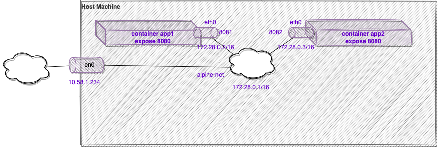
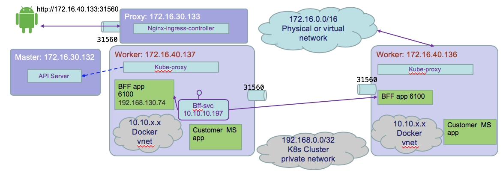

# Networking

With kubernetes it is important to understand how the networking, load balancing, security and service communication, work. In multi-host deployments, you need to understand how containers are communicating within a host and between different hosts .

## Docker networking

With Docker there are four networking mode approaches: `bridge, host, container or no networking` mode.
With `bridge` mode docker daemon creates a `docker0` virtual ethernet bridge to forward packets to any interface attached to it. All containers running on the host are attached to this bridge, and peer attached to the container `eth0` interface, They got an IP address and are part of a subnet. The default bridge network is present on all Docker hosts. If you do not specify a different network, new containers are automatically connected to the default bridge network:

  

Containers are isolated from the host network. Docker containers can talk to other containers only if they are on the same machine.

With `Host mode`  (`docker run -d --net=host  yourimagehere`) the containers share IP and namespace, and you need to take care of the port numbering schema. There is no routing overhead, but this approach exposes the container to the network.  

Docker does not support automatic service discovery on the default bridge network. If you want containers to be able to resolve IP addresses by container name, you should use user-defined networks instead. 

Exposing ports in a Dockerfile is a way of documenting which ports are used, but does not actually map or open any ports. When starting the container the exposed port is published. So for previous figure, we have:

```
$ docker run –d  -p 8081:8080 imagename
```

> When using `nodePort` a dynamic published port number is generated by kubernetes.

When a pod contains two containers, they run their own `cgroup`, but shares IPC, Network, and UTC (hostname) namespaces. This can be proven using the following commands:

```
oc exec -it my-two-container-pod -c side-car -- /bin/sh
ip address
netstat -ntlp
hostname
```

## Kubernetes networking

Kubernetes uses the `container mode`, where other containers share the same IP address as a previously created containers within the pod: it is set at the pod scope level. It requires each pod to have an IP in a flat networking namespace with full connectivity to other nodes and pods across the network.

The Pod IP address is allocated by Calico IPAM and the networking interface definition within the pod and host is done by Calico CNI plugin. The following diagram illustrates the process:


The following commands help to see these IP schema:

```
$ kubectl get node -o wide
NAME           STATUS  VERSION          EXTERNAL-IP  OS-IMAGE             KERNEL-VERSION      
172.16.40.137  Ready   v1.10.0+icp-ee   <none>       Ubuntu 16.04.3 LTS   4.4.0-112-generic   
172.16.40.139  Ready   v1.10.0+icp-ee   <none>       Ubuntu 16.04.3 LTS   4.4.0-112-generic  
# The 172.16.40.137 is the IP address of the HOST
$ kubectl describe node 172.16.40.137
# but ssh to the host/node and looking at the interface, we can see the ethernet and docker interfaces:
$ ifconfig
ens160    Link encap:Ethernet  HWaddr 00:50:56:a5:cf:34  
          inet addr:172.16.40.137  Bcast:172.16.255.255  Mask:255.255.0.0

docker0   Link encap:Ethernet  HWaddr 02:42:73:1c:72:ca  
           inet addr:172.17.0.1  Bcast:172.17.255.255  Mask:255.255.0.0
```

This IP-per-pod model yields a backward-compatible way for you to treat a pod almost identically to a VM or a physical host, in the context of naming, service discovery, or port allocations. Containers inside a pod can communicate with each other using `localhost`.  

Kubernetes using Calico as Container Network Interface is configured with a large flat subnet (e.g. 172.30.0.0/16) that is considered internal application traffic inside of the cluster. Each worker node in the Kubernetes cluster is assigned one or more non-overlapping slices of this network, coordinated by the Kubernetes master node. When a container is created in the cluster, it gets assigned to a worker node and is given an IP address from the slice of the subnet for the worker node.


Kube-proxy intercepts and controls where to forward the traffic, internal to the node, or to another worker node running the destination pod, or outside of the cluster.   

For inter-pod networking as pod has its own routable IP address there is no need for proxies or NAT. Except that with Kubernetes, services use a completely separate set of IP addresses. The IP addresses are not known by Calico, and are not directly routable. However, they are still reachable by pods since the kube-proxy performs NAT on those IPs (NAT from svc IP@ to Pod IP @).

Any pod can communicate with any another pod using its assigned IP address, even if it’s on a different worker node.

K8s Services are used as virtual IP address (it is k8s concept), that are discovered via DNS and allow clients to reliably discover and connect to containers.


### Services

* **Services group** a set of pods and provide network connection to these pods for other services in the cluster without exposing the actual private IP address of each pod. https://kubernetes.io/docs/concepts/services-networking/service/

* A **Service** in Kubernetes is an abstraction which defines a logical set of Pods and a policy by which to access them. Services enable a loose coupling between dependent Pods.

As Pods are ephemeral in nature, resources like IP addresses allocated to it cannot be static. As an example the pods running for the BFF apps are:
  ```
  $ kubectl get pods -n greencompute -o wide
  NAME                                                  READY     STATUS    RESTARTS   AGE       IP                NODE
  gc-caseportal-bc-caseportal-app-698f98d787-56qz5      1/1       Running   0          5d     192.168.130.74   172.16.40.138
  gc-caseportal-bc-caseportal-app-698f98d787-bhl5f      1/1       Running   0          5d     192.168.223.17   172.16.40.137
  ```
  The 192.168.x.x is a flat, cluster wide, address space. As illustrated in the figure below:




  The command shows the `eth0` interface in the container is map to this IP address.
  ```
  $ kubectl exec gc-caseportal-bc-caseportal-app-698f98d787-56qz5 -- ip addr
  ....
4: eth0@if16: <BROADCAST,MULTICAST,UP,LOWER_UP,M-DOWN> mtu 1500 qdisc noqueue state UP
    link/ether c2:74:08:4a:69:3f brd ff:ff:ff:ff:ff:ff
    inet 192.168.130.74/32 scope global eth0

  ```
  You can use Kubernetes services to make an app available to other pods inside the cluster or to expose an app to the internet by abstracting the dynamic IP address assignment. The yaml below creates the casewebportal-svc: `kubectl apply -f svc.yml`

  ```yaml
  apiVersion: v1
  kind: Service
  metadata:
    name: casewebportal-svc
    namespace: greencompute
    labels:
      app: casewebportal
  spec:
    type: NodePort
    ports:
    - port: 6100
      targetPort: 6100
      protocol: TCP
      name: http
    selector:
      app: casewebportal
  ```

  By default, each Service also gets an IP address (known as **ClusterIP**), which is routable only inside the cluster. The target port 6100 is visible as 31560 on the node

  ```
  $ kubectl get  svc
  NAME                                 TYPE        CLUSTER-IP     EXTERNAL-IP   PORT(S)          AGE
  casewebportal-svc                    NodePort    10.10.10.197   <none>        6100:31560/TCP   6d
  ```

A Service is backed by a group of Pods. These Pods are exposed through endpoints. The command below displays the endpoints. The port number stays the same on all worker nodes and event Proxy node.
```
$ kubectl  get ep casewebportal-svc
NAME                ENDPOINTS                                 AGE
casewebportal-svc   192.168.130.74:6100,192.168.223.17:6100   6d
```
When a Pod runs on a Node, the kubelet adds a set of environment variables for each active Service. You can see those variables with the command:

```
$ kubectl exec gc-caseportal-bc-caseportal-app-698f98d787-56qz5 -- printenv
```

A Service does the load balancing while selecting the Pods for forwarding the data/traffic. It uses the label and label selector to get access to the pods.

Kubernetes offers a **DNS cluster addon** Service that automatically assigns dns names to other Services:
```
$ kubectl get services kube-dns --namespace=kube-system
NAME       TYPE        CLUSTER-IP    EXTERNAL-IP   PORT(S)         AGE
kube-dns   ClusterIP   10.10.10.10   <none>        53/UDP,53/TCP   10d
```
So we can do a `nslookup` within any pod to assess where to find the service:

```
$ kubectl exec gc-caseportal-bc-caseportal-app-698f98d787-56qz5 -- nslookup casewebportal-svc

nslookup: can't resolve '(null)': Name does not resolve
Name:      casewebportal-svc
Address 1: 10.10.10.197 casewebportal-svc.greencompute.svc.cluster.local
```
You can access ClusterIP service using the cluster local proxy:
  * Start the kubernetes local proxy: `kubectl proxy --port=8080`
  * Access the service via url like: http://localhost:8080/api/v1/proxy/namespaces/NAMESPACE/services/SERVICE-NAME:PORT-NAME/


We can define a service without selectors, so no Endpoint object will be created, and we can map to your endpoint via the subset.addresses.ip spec. This is useful to abstract other kinds of backend component like DB server, a service in another namespace...

The **NodePort** ServiceType is useful when we want to make the services accessible from the external world. BUT if the IP address of the VM change you need to take care of this problem in your client code.
The end-user connects to the Worker Nodes on the specified port, which forwards the traffic to the applications running inside the cluster. To access the application from the external world, administrators can configure a reverse proxy outside the Kubernetes cluster and map the specific endpoint to the respective port on the Worker Nodes. See this article:
https://medium.com/google-cloud/kubernetes-nodeport-vs-loadbalancer-vs-ingress-when-should-i-use-what-922f010849e0

Using NGINX server as front end and load balancer, the routing can be done outside the cluster. The following conf file an be deployed in the /etc/nginx/conf.d folder and will help to load balance between two pods:

```
upstream caseportal {
  server 172.16.40.137:31560;
  server 172.16.40.138:31560;
}
server {
  location / {
  proxy_pass http://caseportal;
  }
}
```

Alternate is to use **LoadBalancer** service.
With the LoadBalancer ServiceType: NodePort and ClusterIP Services are automatically created, and the external load balancer will route to them. The Services are exposed at a static port on each Worker Node. The Service is exposed externally using the underlying Cloud provider's load balancer feature. If you want to directly expose a service, this is the default method. All traffic on the port you specify will be forwarded to the service.

Finally,the last model is by using ingress.

### Ingress

Ingress is another method (from LoadBalancer and NodePort) we can use to access our applications from the external world. It works at layer 7 traffic. The Kubernetes cluster must have an Ingress controller deployed to be able to create Ingress resources. The Ingress controller is deployed as a Docker container. Its Docker image contains a load balancer like NGInx and a controller daemon. The controller daemon receives the desired Ingress configuration from Kubernetes, it generates an NGInx configuration file and restarts the load balancer process for changes to take effect. Ingress controller is a load balancer managed by Kubernetes.
Ingress helps to decouple the routing rules from the application, we can then update our application without worrying about its external access. With Ingress, users don't connect directly to a Service. Users reach the Ingress endpoint, and, from there, the request is forwarded to the respective Service.
You can define one ingress for all the component of your application you want to expose to external world.

```yaml
apiVersion: extensions/v1beta1
kind: Ingress
metadata:
  name: web-ingress
spec:
  rules:
  - host: myservice.mydomain.com
    http:
      paths:
      - path: /dashboardbff
      - backend:
          serviceName: dashboard-bff-svc
          servicePort: 8080
  - host: green.myweb.com
    http:
      paths:
      - backend:
          serviceName: green-service
          servicePort: 80
```


### Service Discovery

As soon as the Pod starts on any Worker Node, the **kubelet** daemon running on that node adds a set of environment variables in the Pod for all active Services. Be careful while ordering Services, as the Pods will not have the environment variables set for Services which are created after the Pods are created.
The DNS add-on, creates a DNS record for each normal Service and its format is like `my-svc.my-namespace.svc.cluster.local` within the same namespace can reach to other services with just their name.

The following diagram groups all those networking concepts to illustrates, Ingress, service, kube-proxy and label selectors:

  

### Kubernetes DNS

Kubelets resolve hostnames for pods through a Service named `kube-dns`. kube-dns runs as a pod in the kube-system namespace. Every Service that is created is automatically assigned a DNS name. By default, this hostname is `ServiceName.Namespace`. All Services that are in the same namespace may omit `Namespace` and just use `ServiceName`. Here is an example:

To understand the default kubernetes DNS pod, you can run

```
k describe pod kube-dns-nw8gf -n kube-system
```

It watches the Kubernetes master for changes in Services and Endpoints, and maintains in-memory lookup structures to serve DNS requests. It has a static address, and kubelet passes DNS to each container with the --cluster-dns=<dns-service-ip> flag. The default domain is `cluster.local`.


## Security

With kubernetes deployed internally, companies have control over their physical environment, network, operating system patches, access to authentication and authorization internal registry. They control data access, access to administration console for the platform and the workload deployed. 

As part of security is the Identity and access management to control access to resource and connection protocol like [OpenID](https://openid.net/what-is-openid). A team is a logical grouping of resources, users, and user groups. Teams can be restricted to all resources within a namespace.  Access control gateway enforces role-based access control (RBAC) for all registered services.

Network segmentation to provide isolation, using DMZ VLAN for specific workload, so deploying cluster in DMZ. And use VLAN to segment the physical network, subnets, clusters and namespaces to add more segmentation.   

   

Segmentation will depend of the application requirements.
For securing kubernetes network control, you will have Edge nodes that are worker nodes with only ingress workloads and network policies.  Traffic reaches application through private network. Backend services may not have access from public network. K8s [network policy](https://kubernetes.io/docs/concepts/services-networking/network-policies/) specifies how pods can communicate with each other, and [Calico](https://www.projectcalico.org/), the IP based networking, implements the policies (rule per IP addresses). Rules are ORe'ed, if any ingress /egress rule matches connection is allowed. Their are scoped at namespace level.

We can isolate application using labels. THe srv1 backend can be access only from the frontend

```
kind: NetworkPolicy
apiVersion: networking.k8s.io/v1
metadata:
  name: backend-allow
spec:
  podSelector:
    matchLabels:
      app: Srv1
      Tier: backend
  ingress:
  - from:
      - podSelector:
          matchLabels:
            app: Srv1
            Tier: frontend

```

and the db backend can only be access from the srv1 backend.

```
kind: NetworkPolicy
apiVersion: networking.k8s.io/v1
metadata:
  name: db-allow
spec:
  podSelector:
    matchLabels:
      app: Srv1
      Tier: db
  ingress:
  - from:
      - podSelector:
          matchLabels:
            app: Srv1
            Tier: backend

```

[>> NEXT](k8s-2.md)